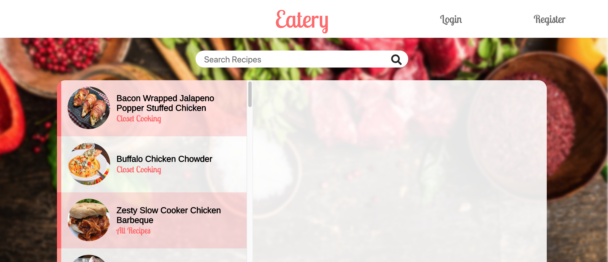
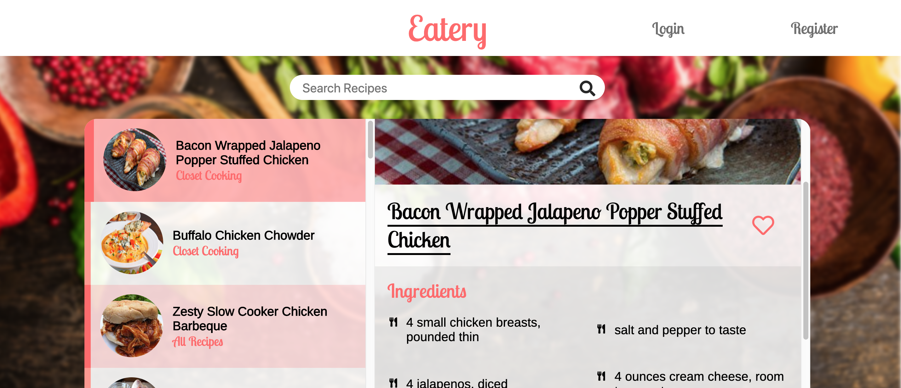
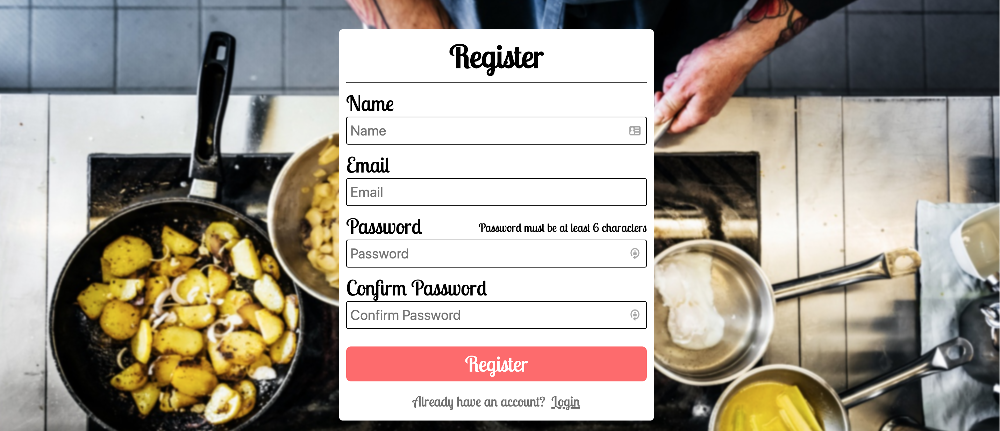
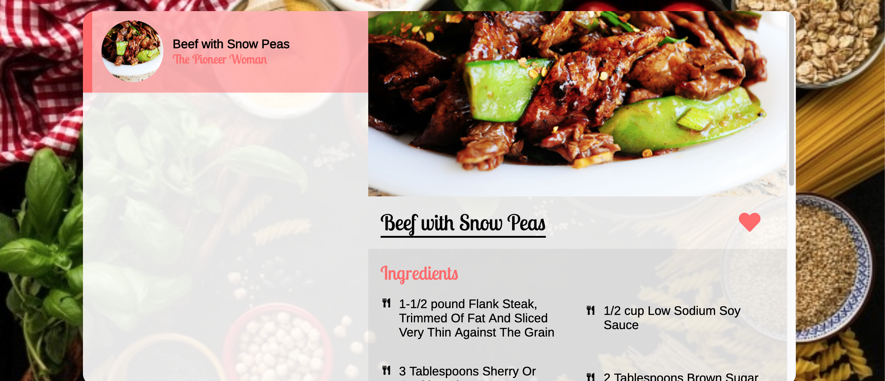

# Eatery

A recipe search engine built with React and Node JS, powered by the [Food2Fork API](https://www.food2fork.com/about/api).

## Built With

### Front-End

- React
- SCSS  

[Atomic Design](http://bradfrost.com/blog/post/atomic-web-design/) component folder structure.
### Back-End
- NodeJS/Express 
- MongoDB/Mongoose     

## Functionality
### Search for recipes
From the home page, users can search for any recipe they desire.

Once searched, a request will be made to the Food2Fork API and will populate a list of found recipes.

Users can then click on a recipe of their choose to get more information on said recipe.

### Create an Account and Store Recipes
Users are able to create an account to save their favorite recipes. User's passwords are encrypted with [bcrypt](https://github.com/kelektiv/node.bcrypt.js#readme), a hashing library, before being stored in the database. Private routes are protected with [passport](http://www.passportjs.org/docs/) which requires a valid [JSON web token](https://jwt.io/), generated when the user logs in (1 hour time limit before it expires and user gets logged out).

## License
This project is licensed under the MIT License - see the LICENSE.md file for details
